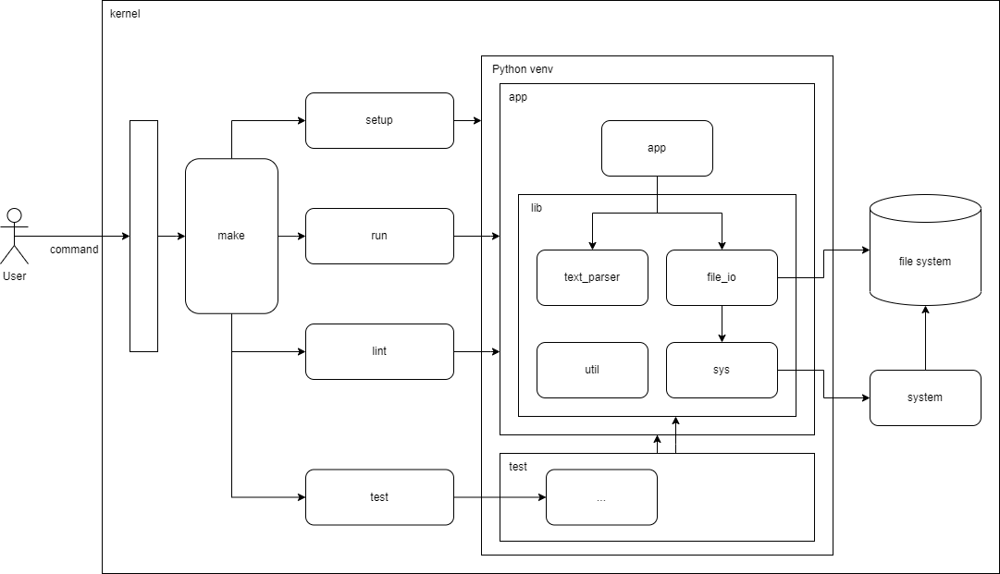

# Thought 1 - Problem

No coding or solution yet, just understand the problem. 

### What is the problem?

print formatted lines in a file where words in the line contain a substring.

### Constrains

- the script recieves 1 argument
    - the argument must be a path
- Each line contains
    - string
    - three words
    - surrounded by symbols, numbers and spaces
- Search term is always on the last line
- Output when the line contains the search term
    - three words seperated by a space
    - surrounded by square brackets

# Thought 2 - Simple Solution

Explore an pseudo solution to the problem.

### Pseudo steps

- read the last line in the file to determine the search term
- iterate through each line (except the last):
    - for each line parse the three words
    - check if the substring exists in any of the words
    - if yes: 
        - format the three words
        - print formatted words 

# Thought 3 - Solutions

Explore different ideas for a solution.

## Line Iteration

How the program will iterate through the file to retrieve the necessary information.

### Solution 1

- load all lines into memory
- retrieve the search term by looking at the last item in the list of lines
- iterate through each element
- print matches in order

O(n) = 2n

**Pros:** Simple

**Cons:** Uses a lot of memory, if the file has a lot of lines the code program will struggle

### Solution 2

Each line could be processed using **multi-threading**, however, due to the output being printed in order there is no benefit as the order would have to be recorded somewhere then re-iterated. It is also overcomplicating a simple application, as the program has to only handle one file, piping the output is definately optimal.

### Solution 3

All file lines could be accessed iteratively so the memory isn't overloaded, however, the last line needs to be accessed before iterating through the whole file.

The bytes of the last line could be accessed in python or using a terminal command (tail), allowing for the file to be parsed once.

O(n) = n

## Liner Parser

How each line will be parsed to retrieve the three words, and potentially detect if its the search term.

Constraints to think about:
 - what is the maximum length per line?
 - what character encodings are allowed for the words?
 - is the input a string (empty or numbers)

### Max Line Length

The maximum length allowed for a string per line is dependent on the amount of RAM available on the machine and what the python version allows. To estimate what to should expect, the longest words can be used a reference as we know each line will have 3 words. The [longest words](https://www.dictionary.com/e/longest-words-in-the-world/) around the world consist of:

#### Protein Name

https://www.digitalspy.com/fun/a444700/longest-word-has-189819-letters-takes-three-hours-to-pronounce/

*189,819 characters*

#### English 
Pneumonoultramicroscopicsilicovolcanoconiosis

*45 characters*

#### Sanskrit 
निरन्तरान्धकारित-दिगन्तर-कन्दलदमन्द-सुधारस-बिन्दु-सान्द्रतर-घनाघन-वृन्द-सन्देहकर-स्यन्दमान-मकरन्द-बिन्दु-बन्धुरतर-माकन्द-तरु-कुल-तल्प-कल्प-मृदुल-सिकता-जाल-जटिल-मूल-तल-मरुवक-मिलदलघु-लघु-लय-कलित-रमणीय-पानीय-शालिका-बालिका-करार-विन्द-गलन्तिका-गलदेला-लवङ्ग-पाटल-घनसार-कस्तूरिकातिसौरभ-मेदुर-लघुतर-मधुर-शीतलतर-सलिलधारा-निराकरिष्णु-तदीय-विमल-विलोचन-मयूख-रेखापसारित-पिपासायास-पथिक-लोकान्

*195 characters*

#### Ancient Greek
λοπαδο­τεμαχο­σελαχο­γαλεο­κρανιο­λειψανο­δριμ­υπο­τριμματο­σιλφιο­καραβο­μελιτο­κατακεχυ­μενο­κιχλ­επι­κοσσυφο­φαττο­περιστερ­αλεκτρυον­οπτο­κεφαλλιο­κιγκλο­πελειο­λαγῳο­σιραιο­βαφη­τραγανο­πτερύγων

*183 characters*

#### Summary

Even though some words can reach 195 characters and some names going over 100k characters, I imagine the average word length would be sensible. For instance, the average word length in English is [5.1](https://www.researchgate.net/figure/Average-word-length-in-the-English-language-Different-colours-indicate-the-results-for_fig1_230764201). However, to include all cases with the assumption the number of characters could go up to the same length, a maximum of 1,000k characters should be allowed. 1,000k characters equates to approximately 1GB, which should be handled by any modern device or machine. This can allow for 3 words with 200k characters with 400k symbols. I expect majority of the lines not to touch this limit, however, its good to consider the expected cases.

### Solution 1

Use a simple regex to select the three words.

This solution is simple and can work for majority of cases, only issue is when you include foreign characters or multiple text encodings (à, á, â, ã, ä) and how are "symbols" defined are emojis symbols? 

### Solution 2

A more complex regex could be created to expand what characters can be used to include other languages. For instance, the use of [character classes](https://learn.microsoft.com/en-us/dotnet/standard/base-types/character-classes-in-regular-expressions#unicode-category-or-unicode-block-p).

### Solution 3

A rediculous solution would be to brute force the solution for characters deemed a word.

## Summary

To conclude, the chosen solution will be [Line Iteration - Solution 3](#solution-3) with [Liner Parser - Solution 1](#solution-1-1). The solution will fit majority of use cases and will be optimised to work with very large files, as the memory will not be overwhelmed.

# Thought 4 - Architecture

Now a solution has been chosen, the layout of the application can be designed, considering how abstraction and inheritance will work. Again I will iterate no coding has been done at this stage.

## Modules

A breakdown of all the modules in the Python application

### App

Where all the pieces are glued together to build a working application.

This involves:
 - Take a file input and printing matching lines

### Text Parser

All functions related to parsing text.

This can involve:
 - Finding n words in a string
 - Checking text format

### File IO

All functions related to reading data from files.

This can involve:
 - Iterate over lines in a file
 - Read the last line in a file

### Sys

All functions that communicate with the system

### Util

Any functions which are useful globally to all modules but cannot be given their own module

## Stack

Prerequisite
 - Python
 - Linux terminal (bash, shell ...)

Targeted OS
 - Linux
 - Apple
 - Windows with Ubuntu interpreter

The chosen stack for the project:
 - Python 3.10
 - Makerfile
 - pylint
 - black
 - unittest

## Makerfile

### Setup

Task creates the python virtual environment and sets up all the dependencies

### Run

Task runs the application

### Lint

Task lints the source code

### Test

Task runs all the unit tests in the application

# Thought 5 - Testing

Test Driven Development! 

The tests which should be applied to each module.

## App

### format_words

#### Positive

- argument check, string ascii
- performance check, t-shirt sizes
- output check
    - correct format of [word word word]

#### Negative

correct error returned
- argument check, int, empty, not ascii, input length

## Text Parser

### extract_words

#### Positive

- argument check, string ascii
- performance check, t-shirt sizes
- output check
    - correct number of words in hidden in the string

#### Negative

correct error returned
- argument check, int, empty, not ascii, input length

### is_ascii

#### Positive

- argument check, string ascii, not ascii, int, none
- performance check, t-shirt sizes
- output check
    - bool

#### Negative

correct error returned
- argument check, empty, input length

## File IO

### file_lines_iter

#### Positive

- argument check, string ascii, full path
- performance check, t-shirt sizes
- output check
    - Python iterator class

#### Negative

correct error returned
- argument check, int, empty, not ascii, input length, not full path
- filesystem doesn't contain file
- corrupt file (file not readable)

### file_last_line

#### Positive

- argument check, string ascii, full path
- performance check, t-shirt sizes
- output check
    - string, last line of file

#### Negative

correct error returned
- argument check, int, empty, not ascii, input length, not full path
- filesystem doesn't contain file
- corrupt file (file not readable)

# Thought 6 - Coding

Now its time to implement! just fill in the missing logic for each funciton.